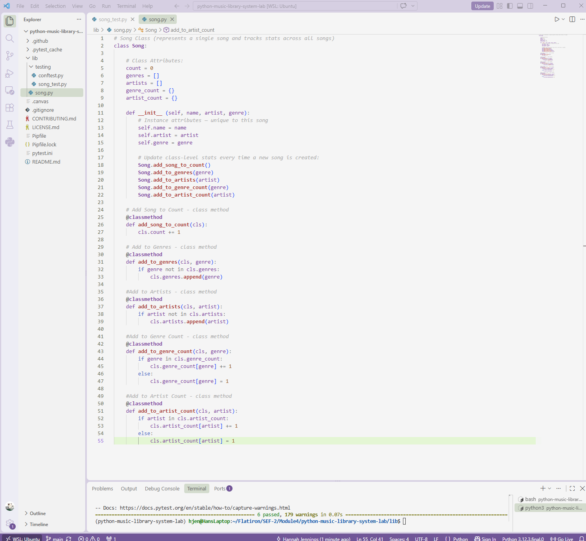

# Music Library System

A Python `Song` class built for a music streaming library. Beyond storing basic
song info, the class tracks library-wide stats across every song ever created:
total song count, unique genres, unique artists, and per-genre / per-artist
song counts.



## Features

Each `Song` instance stores:

* `name`
* `artist`
* `genre`

<br>

The `Song` class (shared across all instances) tracks:

* `count` — total number of songs created
* `genres` — list of all unique genres seen
* `artists` — list of all unique artists seen
* `genre_count` — dict mapping each genre to how many songs belong to it
* `artist_count` — dict mapping each artist to how many songs they have

<br>

These stats update automatically every time a new `Song` is created — no
extra setup required.

## Usage

```python
from song import Song

Song("Halo", "Beyonce", "Pop")
Song("99 Problems", "Jay Z", "Rap")
Song("Sara Smile", "Hall and Oates", "Pop")

print(Song.count)         # 3
print(Song.genres)        # ['Pop', 'Rap']
print(Song.artist_count)  # {'Beyonce': 1, 'Jay Z': 1, 'Hall and Oates': 1}
```

## Installation

Clone the repo and install dependencies:

```bash
git clone <your-fork-url>
cd python-music-library-system-lab
pipenv install
```

## Testing

Run the test suite from the project root:

```bash
pytest
```

## Project Structure

```
lib/
  song.py            # Song class implementation
  testing/
    song_test.py     # Test suite
    conftest.py      # Pytest configuration
```

## Built With

- Python 3
- pytest

## Acknowledgments

Lab exercise from [Flatiron School](https://github.com/learn-co-curriculum/python-music-library-system-lab)
on class attributes, class methods, and inheritance basics.